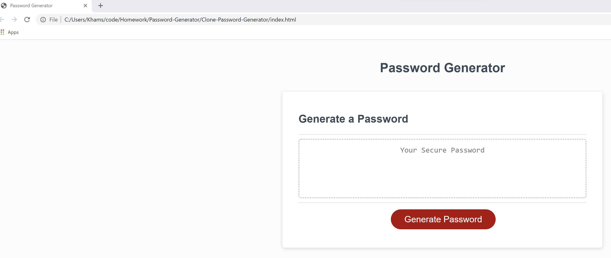

# Password-Generator
<!-- ?This simple assignment generate a password upon the users actions. The user can chose to have Alphabets, numbers, or symbols in their password. After selecting the user preference in passwords the user have the otion of having eight to one hundred and twenty eight characters in length of a random generated password. -->

